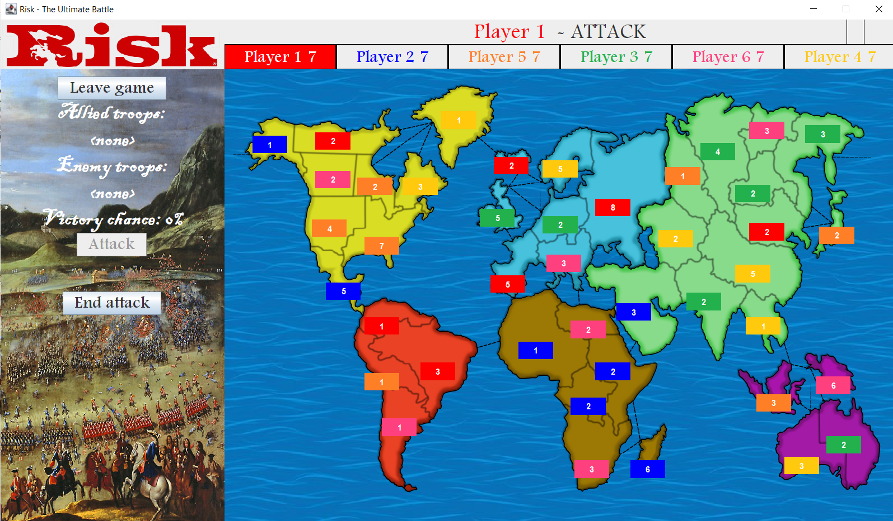
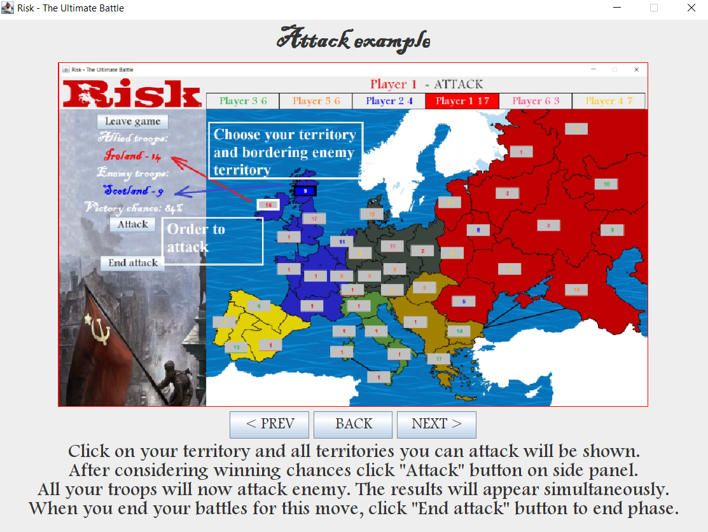
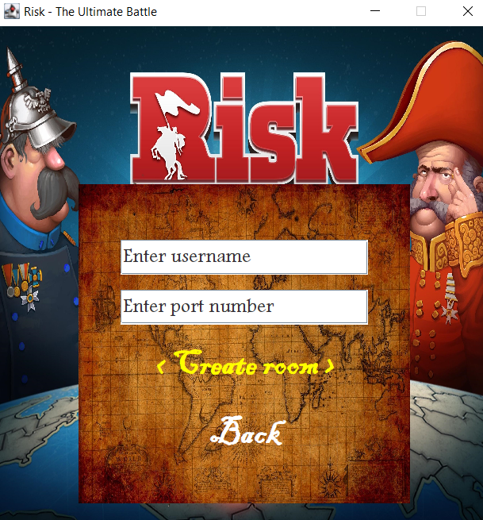
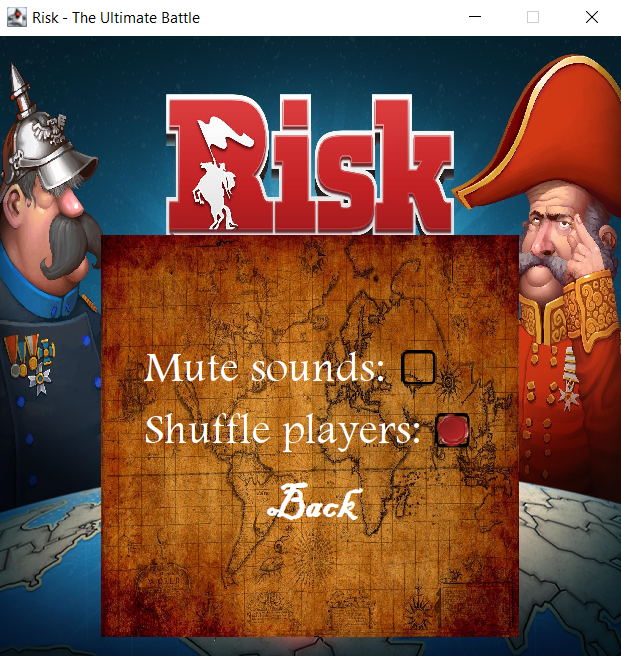

# Risk Game
:video_game: Take over the world in this game of strategy conquest :video_game:
## Description
A Desktop clone of the popular board strategy. 

In the Risk game, the goal is simple: players aim to conquer their enemies' territories by building an army, moving their troops in, and engaging in battle. Depending on the roll of the dice, a player will either defeat the enemy or be defeated.

The game was written as a University project in contribution with @o-klepatskyi
#### Technology used:
Java, Swing

## Team work
<table>
  <tr>
    <td><h4>@navimakarov</h4></td>
    <td><h4>@o-klepatskyi</h4></td>
  </tr>
  <tr>
    <td>Game Logic</td>
    <td>Multiplayer</td>
  </tr>
  <tr>
    <td>Main Window and Map Rendering</td>
    <td>Choose Player Menu</td>
  </tr>
  <tr>
    <td>Set of rules for Bots</td>
    <td>Bot integration into the game</td>
  </tr>
  <tr>
    <td>Main Menu window</td>
    <td>Rules and Settings windows</td>
  </tr>
  <tr>
    <td>Game logging, music effects</td>
    <td>Maps design</td>
  </tr>
 </table>
 
 ## Game Preview

## Demo
https://youtu.be/ohQZLQrSMMk
